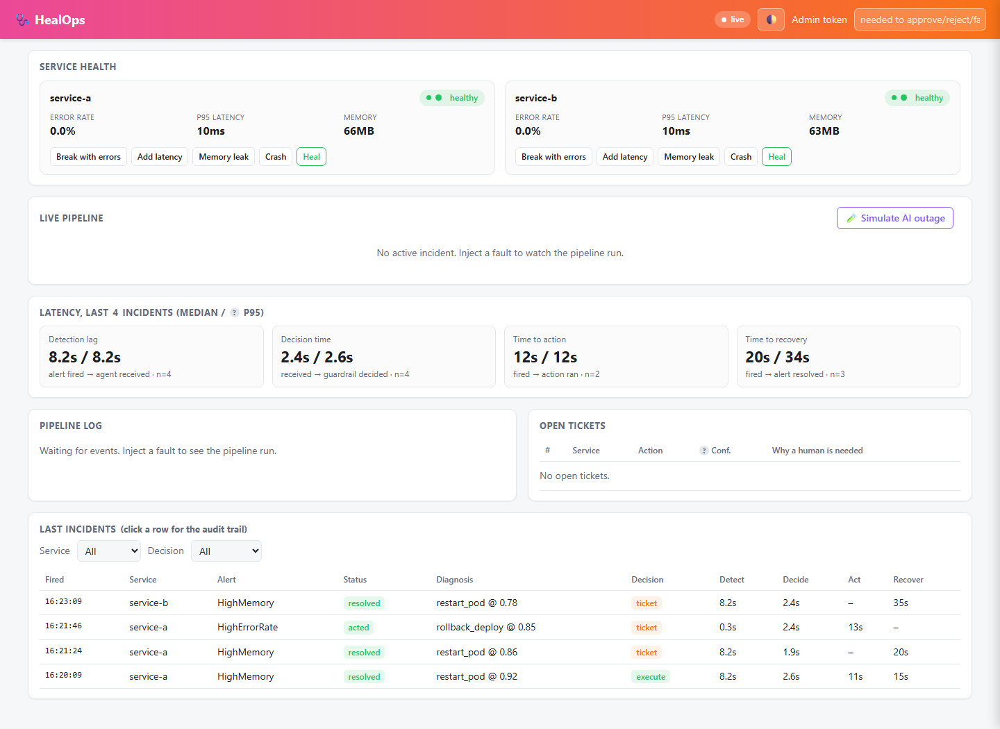
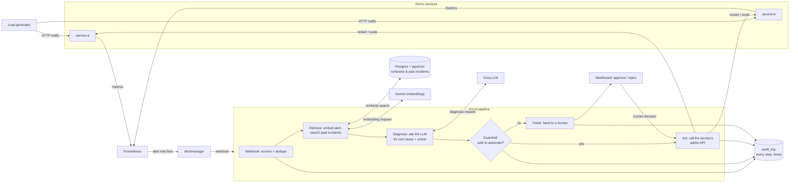

# HealOps

HealOps watches two demo microservices, and when one breaks, it decides what to do
about it on its own — and knows when *not* to. Prometheus notices the problem,
Alertmanager tells the agent, the agent looks up similar past incidents, asks an LLM to
diagnose it, runs that diagnosis through a set of safety rules (the guardrail), and then
either fixes it automatically or opens a ticket for a human. Every step is written down
so you can see exactly why the agent did what it did.



## How it works



Every alert goes through the same five steps: **retrieve** similar past incidents,
**diagnose** with an LLM, check the **guardrail**, then either **act** automatically or
open a **ticket**. Nothing skips the guardrail — not even a confident LLM.

## Setup

You need Docker, Node.js 20+, a [Gemini API key](https://ai.google.dev/) and a
[Groq API key](https://console.groq.com/).

```bash
git clone <this repo>
cd self-healing-agent
cp .env.example .env
# edit .env: set GEMINI_API_KEY, GROQ_API_KEY, and change ADMIN_TOKEN to a real secret

docker compose up -d --build
node scripts/seed-db.js          # embeds the runbooks and past incidents into Postgres
```

Open **http://localhost:3000** — that's the dashboard. Prometheus is at `:9090`,
Alertmanager at `:9093`.

To check everything is healthy:

```bash
curl http://localhost:3000/health
node scripts/query-knowledge.js "memory leak high error rate"   # see what RAG retrieves
```

## Demo walkthrough

The fastest way to see the whole loop is the dashboard itself — no terminal needed:

1. **Break something.** Under "Service health", click **Memory leak** on service-a.
   Its memory climbs in the sparkline; after about a minute `HighMemory` fires and the
   **Live pipeline** panel streams each step live: retrieve → diagnose → guardrail → act.
   The agent restarts the service on its own, and the incident shows up at the top of
   **Last incidents** marked `acted`.
2. **Break it again, right away.** Click **Memory leak** again within a few minutes.
   This time the pipeline reaches the same diagnosis, but the guardrail's **cooldown**
   rule blocks a second automatic restart. It shows up under **Open tickets** instead,
   with the reason spelled out ("restart_pod ran on service-a N min ago"). Click
   **Approve** to run it anyway, or **Reject** to leave it to someone else.
3. **Simulate an AI outage.** Click **🧪 Simulate AI outage**, then break something.
   The next diagnosis fails exactly like a real Groq outage would, and the agent still
   opens a ticket instead of crashing or guessing.
4. **Look at the trail.** Click any row in **Last incidents** to see the full audit
   trail for that incident — every retrieved runbook, the LLM's raw reasoning, and the
   guardrail's decision with its reasons.

Mutating actions (fault buttons, approve/reject) need the admin token from your `.env`
— paste it into the **Admin token** field at the top right first.

For a scripted version of the same idea end to end, including the one scenario the
dashboard can't trigger on its own (a bad deploy — see below), run:

```bash
./scripts/demo.sh            # defaults to service-a; or: ./scripts/demo.sh service-b
```

It injects a memory leak (auto restart), repeats it inside the cooldown window (ticket),
then posts a synthetic "error spike right after a deploy" alert and shows that it is
*always* ticketed for human approval, never run automatically, no matter how confident
the LLM is.

## Measured latency

Pulled from `GET /api/stats` after a demo run (window = last N incidents):

| Stage | What it measures | Median | p95 |
|---|---|---|---|
| Detection lag | alert fires → agent receives the webhook | 8.2s | 8.2s |
| Decision time | agent receives it → guardrail decides | 2.4s | 2.6s |
| Time to action | alert fires → remediation actually runs | 11.7s | 12.5s |
| Time to recovery | alert fires → Prometheus sees it resolved | 20s | 34s |

Detection lag is mostly Prometheus's own `scrape_interval` + alert rule `for:` window
(deliberately short for this demo — see below). Decision time is the RAG lookup plus one
Groq call, almost always under 3 seconds. These numbers are a live demo on one laptop,
not a production SLO; re-run `./scripts/demo.sh` and check `/api/stats` yourself, or
watch it update live on the dashboard.

## Key design decisions

**The guardrail is the real point of this project, and it's pure.** `guardrail.js`
takes a diagnosis, the service's recent action history, and the current time, and
returns `execute` or `ticket` — no I/O, no randomness, nothing hidden. That's what makes
it unit-testable for every rule and auditable after the fact: given the same inputs it
always makes the same call, and that call doesn't depend on wording the LLM happened to
use. The rules, in order:

- `escalate`, `rollback_deploy`, or any action the agent doesn't recognize → always a
  ticket. Rollback is high risk — it can undo a schema or config change the release
  shipped with it — so it needs a human regardless of how confident the LLM is.
- No past incident or runbook matched closely enough → the confidence score is docked a
  penalty before anything else is checked, so a diagnosis with no supporting evidence
  has to clear a higher bar.
- `restart_pod` / `scale_up` → only runs automatically above a confidence threshold
  (0.80 / 0.75 by default).
- **Cooldown** — if the agent already took an automatic action on this service in the
  last 10 minutes, the next one becomes a ticket instead, even at high confidence. This
  stops the agent from restart-looping a service whose problem a restart won't actually
  fix.
- **Circuit breaker** — 3 or more actions on one service inside an hour (automatic or
  human-approved) and everything after that is a ticket, win or lose. If the agent
  keeps getting asked to fix the same service, something structural is wrong and a
  human should look, not get restarted at it again.
- `DRY_RUN=true` downgrades every `execute` to a ticket, so you can watch the whole
  pipeline decide without it touching anything.

**Model choices changed mid-build, and the config reflects that.** The plan was Gemini
embeddings and a Llama chat model on Groq. Llama chat models returned 404 on the Groq
account used for this build, so diagnosis uses `openai/gpt-oss-120b` instead — an
OpenAI-compatible model Groq does serve. Both model IDs live in `.env`, not in code, for
exactly this reason: external model availability changes, and swapping one shouldn't
need a deploy.

**The RAG similarity threshold (`RAG_MIN_SIMILARITY=0.72`) came from actually measuring
it**, not a guess. `node scripts/query-knowledge.js "memory leak high error rate"`
against the seeded runbooks returns:

```
1. 0.8002  runbook  restart_pod     Memory leak: restart the service
2. 0.7914  incident restart_pod     INC-1012: service-a memory leak from unbounded session cache
3. 0.7284  runbook  restart_pod     OOM crash loop: restart once, escalate if repeated
4. 0.7275  incident restart_pod     INC-1061: service-a errors from a poisoned connection pool
5. 0.7197  runbook  restart_pod     Error spike with no deploy and healthy dependencies: restart
```

0.72 sits just above the genuinely unrelated results and below the real matches, so the
agent keeps the runbooks that are actually about the alert and drops the ones that
merely mention similar words. Changing the embedding model invalidates every stored
vector (they're not comparable across models), so the seed script re-embeds everything
with `--force` rather than trying to mix vector spaces.

**Alert windows are deliberately short for a demo**, not for production. `HighErrorRate`
fires on a 30-second window instead of the usual 1 minute, and Alertmanager's
`group_wait`/`repeat_interval` are shrunk to seconds instead of minutes, so you don't
wait several minutes to see the pipeline react. Both files comment the production
tradeoff where the demo value diverges from it.

**The agent never acts on an LLM it can't trust.** If Groq returns invalid JSON, it gets
one retry, then falls back to `escalate` with `confidence: 0` and the reason
`llm_invalid_output`. If the call fails outright (timeout, network, bad key), it falls
back the same way with `llm_error`. Either way, a ticket, not a crash and not a guess.

## Known limitations

- **The services are simulated.** `services/demo` is one small Express app run twice;
  its fault modes (`error`, `latency`, `memory`, `crash`) are deliberately simple ways
  to make `/metrics` look unhealthy. They don't reproduce the full mess of a real
  production incident.
- **There's no real Kubernetes cluster.** `restart_pod` and `scale_up` call the demo
  service's own admin endpoints, not `kubectl` or the Kubernetes API.
  `agent/src/actions.k8s.reference.js` shows what the equivalent real calls would look
  like (delete pod, patch replicas, `rollout undo`), but it's reference code, not wired
  in. `rollback_deploy` is always simulated — these services have no release history to
  roll back to.
- **Everything runs on one machine.** Prometheus, Alertmanager, Postgres, and the agent
  are all `docker compose` containers on localhost. There's no multi-node setup, no
  real network partition between them, and no load beyond what the built-in load
  generator produces.
- **Diagnosis quality depends on the LLM**, which means it isn't perfectly
  deterministic — rerun the same fault twice and you may get slightly different
  confidence scores or even a different diagnosed action (the guardrail's decision
  given that diagnosis *is* deterministic, which is the part that actually matters for
  safety). `scripts/demo.sh` is written to tolerate this: it checks that the second
  memory fault gets ticketed, not that it is ticketed for the exact same reason every
  time.
- **No user accounts.** The dashboard's mutating actions are protected by one shared
  admin token, not per-person login — fine for a demo, not for a real on-call rotation.
